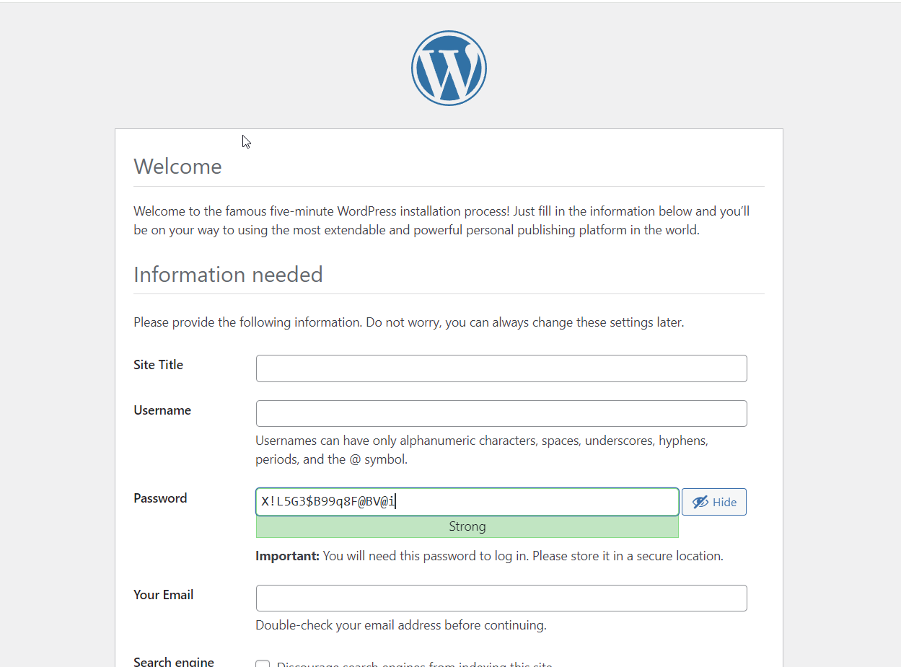
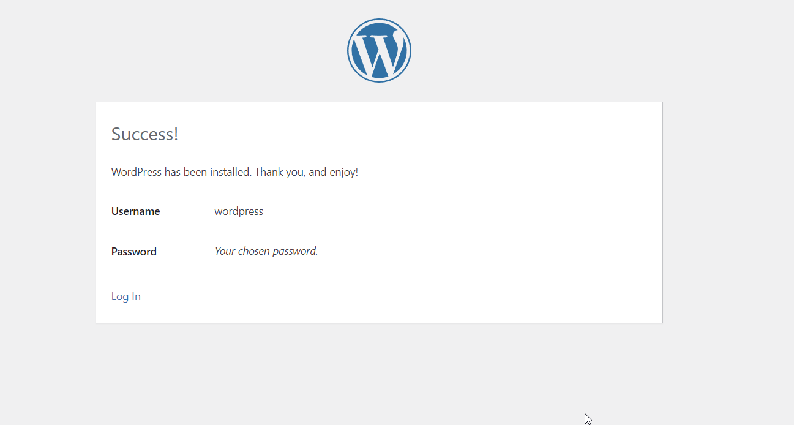
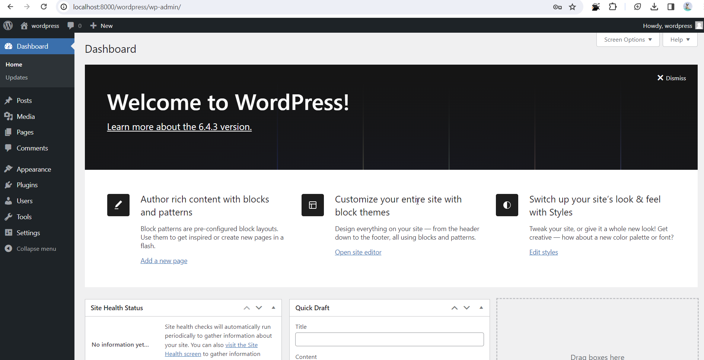

# Лабораторная работа №4: Запуск сайта в контейнере

# Цель работы
Выполнив данную работу студент сможет подготовить образ контейнера для запуска веб-сайта на базе Apache HTTP Server + PHP (mod_php) + MariaDB.

# Задание
Создать Dockerfile для сборки образа контейнера, который будет содержать веб-сайт на базе Apache HTTP Server + PHP (mod_php) + MariaDB. База данных MariaDB должна храниться в монтируемом томе. Сервер должен быть доступен по порту 8000.

Установить сайт WordPress. Проверить работоспособность сайта.

# Выполнение
После создания всех необходимых файлов/папок строим образ контейнера с именем apache2-php-mariadb при помощи команды:
```docker build -t apache2-php-mariadb .``` 
в докерфайл мы поместили следующий код:
```# create from debian image
FROM debian:latest

# install apache2, php, mod_php for apache2, php-mysql and mariadb
RUN apt-get update && \
    apt-get install -y apache2 php libapache2-mod-php php-mysql mariadb-server && \
    apt-get clean
```
После запуска образа у нас скачиваются файлы apache2, php, mod_php for apache2, php-mysql and mariadb
Образ строился 173,2 секунды 

Создайте контейнер apache2-php-mariadb из образа apache2-php-mariadb и запустите его в фоновом режиме с командой запуска bash.
``` docker run -d --name apache2-php-mariadb apache2-php-mariadb bash```
```
mkdir -p files/apache2
mkdir -p files/php
mkdir -p files/mariadb

docker cp apache2-php-mariadb:/etc/apache2/sites-available/000-default.conf files/apache2/
docker cp apache2-php-mariadb:/etc/apache2/apache2.conf files/apache2/
docker cp apache2-php-mariadb:/etc/php/8.2/apache2/php.ini files/php/
docker cp apache2-php-mariadb:/etc/mysql/mariadb.conf.d/50-server.cnf files/mariadb/
```
Производим все необходимые манипуляции в файлах 

Создаем в папке files папку supervisor и файл supervisord.conf со следующим содержимым:
```
[supervisord]
nodaemon=true
logfile=/dev/null
user=root

# apache2
[program:apache2]
command=/usr/sbin/apache2ctl -D FOREGROUND
autostart=true
autorestart=true
startretries=3
stderr_logfile=/proc/self/fd/2
user=root

# mariadb
[program:mariadb]
command=/usr/sbin/mariadbd --user=mysql
autostart=true
autorestart=true
startretries=3
stderr_logfile=/proc/self/fd/2
user=mysql
```
Соберите образ контейнера с именем apache2-php-mariadb и запустите контейнер apache2-php-mariadb из образа apache2-php-mariadb. Проверьте наличие сайта WordPress в папке /var/www/html/. Проверьте изменения конфигурационного файла apache2.

## Создание базы данных и пользователя
Создайте базу данных wordpress и пользователя wordpress с паролем wordpress в контейнере apache2-php-mariadb. Для этого, в контейнере apache2-php-mariadb, выполните команды:
```
mysql
CREATE DATABASE wordpress;
CREATE USER 'wordpress'@'localhost' IDENTIFIED BY 'wordpress';
GRANT ALL PRIVILEGES ON wordpress.* TO 'wordpress'@'localhost';
FLUSH PRIVILEGES;
EXIT;
```
## Создание файла конфигурации WordPress
Откройте в браузере сайт WordPress по адресу ```http://localhost:8000/wordpress/```. 
## Добавление файла конфигурации WordPress в Dockerfile
Добавьте в файл Dockerfile следующие строки:
```
# copy the configuration file for wordpress from files/ directory
COPY files/wp-config.php /var/www/html/wordpress/wp-config.php
```
## Запуск и тестирование
Пересоберите образ контейнера с именем apache2-php-mariadb и запустите контейнер apache2-php-mariadb из образа apache2-php-mariadb. Проверьте работоспособность сайта WordPress.

## Работает !!!




# Ответьте на вопросы:

Какие файлы конфигурации были изменены?
* Были изменены файлы конфигурации для apache2, php, mariadb, supervisor и добавлен файл конфигурации WordPress (wp-config.php).

За что отвечает инструкция `DirectoryIndex` в файле конфигурации apache2?
* `DirectoryIndex` в файле конфигурации Apache определяет список файлов, которые сервер будет искать по умолчанию в директории, если запрос от клиента не указывает конкретный файл.

Зачем нужен файл wp-config.php?
* Файл wp-config.php в WordPress содержит основные настройки для подключения к базе данных, а также другие важные конфигурационные параметры, необходимые для работы сайта, такие как ключи безопасности, параметры кэширования и настройки языка.

За что отвечает параметр post_max_size в файле конфигурации php?
* Параметр post_max_size в файле конфигурации PHP определяет максимально допустимый размер данных, отправляемых через HTTP POST запросы.

Укажите, на ваш взгляд, какие недостатки есть в созданном образе контейнера?
* На мой взгляд, самый большой недостаток в созданном образе контейнера это то, что нужно очень часто пересобирать контейнер (при каждом изменениии) заново вводить команды.

## Вывод:

В результате выполнения лабораторной работы мы создали образ контейнера, предназначенный для запуска веб-сайта на базе Apache HTTP Server с поддержкой PHP (используя модуль mod_php) и базы данных MariaDB в среде Docker. Мы успешно проверили работоспособность сайта WordPress в этой среде, что подтверждает корректность нашей настройки и конфигурации.

Проще было скачать с официального сайта WordPress .